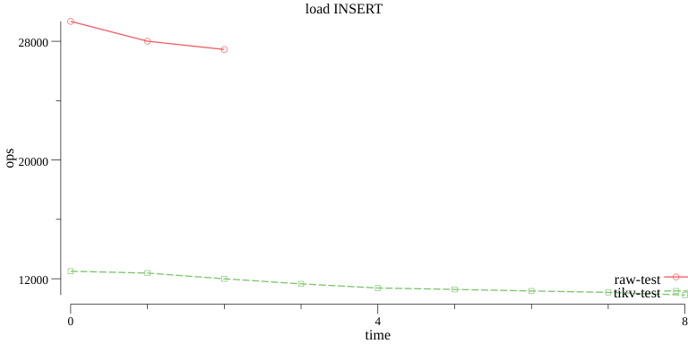

# YCSB toolbox 

## Benchmark 

The script `./bench.ch` can help you run [go-ycsb](https://github.com/pingcap/go-ycsb) to benchmark different. Below are some examples:

```bash
# Load data into TiKV with Raw mode
./bench.ch load raw -p tikv.pd=127.0.0.1:2379

# Run workloads a, b, ... e for TiKV with Raw mode
./bench.ch run raw -p tikv.pd=127.0.0.1:2379

# Run benchmark and output the result to the OUTPUT directory
OUTPUT=./20190601 ./bench.ch load raw
```

## Reporter

The `ycsb-reporter` can help you generate some charts from the benchmark results. It can help you compare the performance of different databases, or check the performance changes of different versions for one database.

### Install

```bash
# Enter dbbench root directory

make 

# The ycsb-reporter is installed in the dbbench/bin directory
```

### Usage

Please notice that you must use the same workload to do the benchmark, and save the benchmark result to a unique directory for later comparision. For example, if you want to compare the performance of TiKV 2.1 and 3.0, you can use like below:

```bash
# Load data into TiKV 2.1 
OUTPUT=./2.1 ./bench.ch load raw -p tikv.pd=pd_2.1

# Load data into TiKV 3.0
OUTPUT=./3.0 ./bench.ch load raw -p tikv.pd=pd_3.0

# You must use different directories for benchmarking the same database, the ycsb-reporter will use 
# `raw-3.0` and `raw-2.1` (the name format is db-parentDir) to distinguish the results in the output charts. 
ycsb-reporter -p 2.1 -p 3.0 -o var 
```

If you want to compare different databases, you can save all data in one directory, e.g:

```bash
# Benchmark TiKV with Raw mode
./bench.ch load raw
# Benchmark TiKV with TiKV mode
./bench.ch load tivk

# Passing -i here to tell reporter to use db name only (no need to include the parent directory) as identification in the chart, 
ycsb-reporter -p ./logs -o var -i
```

If you only want to care some workloads or some databases, you can do:

```bash
# Only care tikv and raw
ycsb-reporter -p ./logs -o var -d tikv -d raw

# Only care load
ycsb-reporter -p ./logs -o var -w load

# Only care raw and load
ycsb-reporter -p ./logs -o var -d raw -w load
```

The output chart may look like:



You can see more examples [here](./exmaples)
